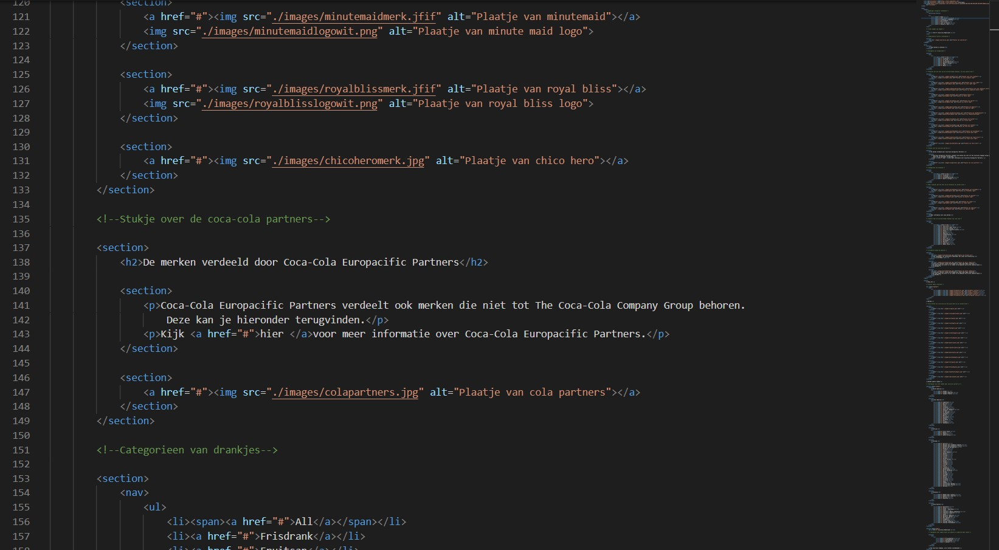
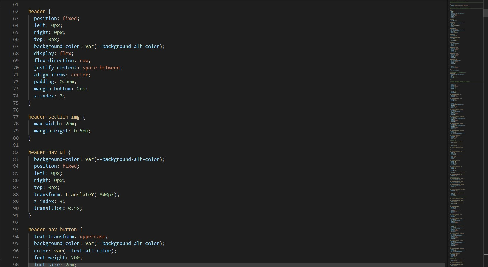
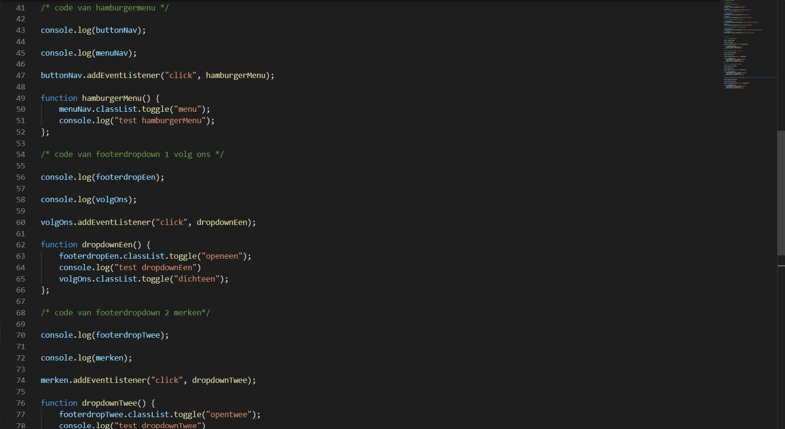
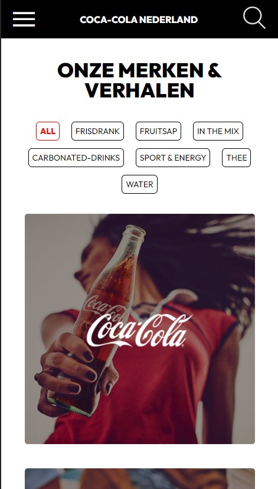
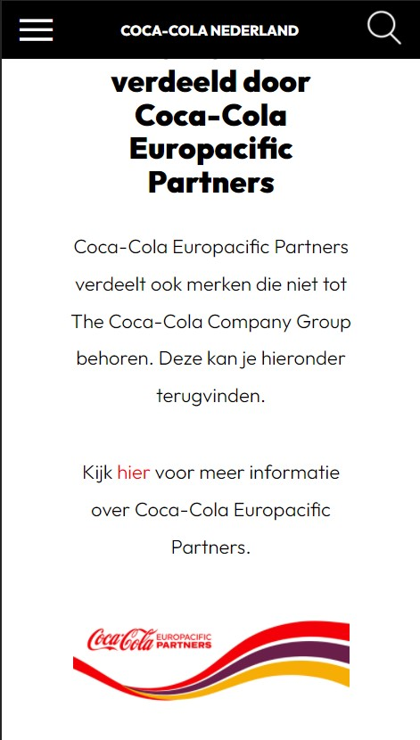
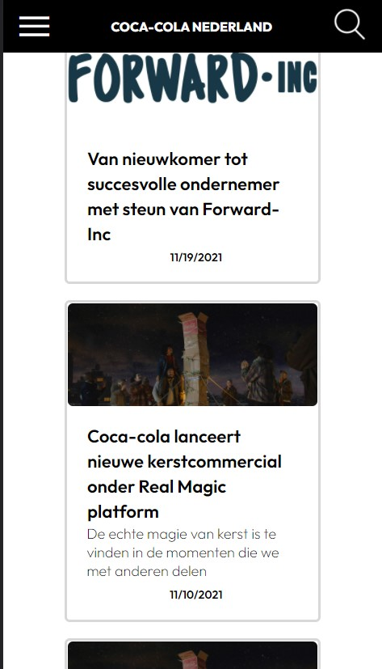
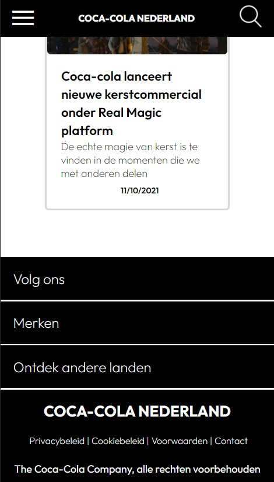
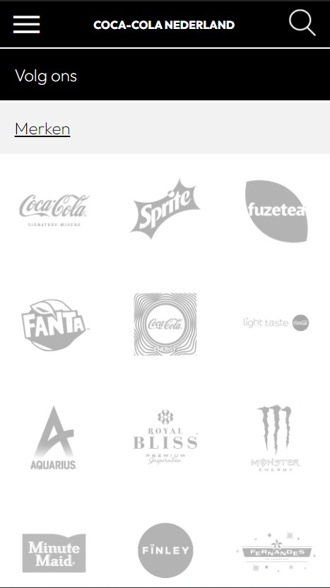
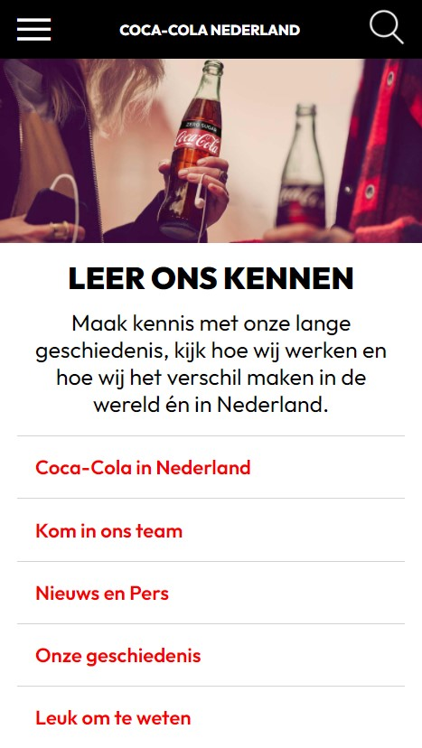

# Procesverslag
Markdown is een simpele manier om HTML te schrijven.  
Markdown cheat cheet: [Hulp bij het schrijven van Markdown](https://github.com/adam-p/markdown-here/wiki/Markdown-Cheatsheet).

Nb. De standaardstructuur en de spartaanse opmaak van de README.md zijn helemaal prima. Het gaat om de inhoud van je procesverslag. Besteedt de tijd voor pracht en praal aan je website.

Nb. Door *open* toe te voegen aan een *details* element kun je deze standaard open zetten. Fijn om dat steeds voor de relevante stuk(ken) te doen.

## Jij

uitwerken voor kick-off werkgroep

### Auteur:
Thimo Gagliano

#### Je startniveau:
Rode piste

#### Je focus:
Focus op de surface plane
 

## Je website

uitwerken voor kick-off werkgroep

### Je opdracht:
Voor deze opdracht ga ik pagina's namaken van de website van Coca Cola Nederland. De link naar de website: https://www.cocacolanederland.nl/

#### Screenshot(s) van de eerste pagina (small screen): 
De eerste pagina van de website is vermeld als: Onze merken en verhalen, link is https://www.cocacolanederland.nl/onze-merken-en-verhalen 

#### Screenshot(s) van de tweede pagina (small screen):
De tweede pagina van de website is vermeld als: Leer ons kennen, link is https://www.cocacolanederland.nl/leer-ons-kennen  

 

## Breakdownschets (week 1)

uitwerken na afloop 2e werkgroep

### de hele pagina: 

### dynamisch deel 1, : 

### dynamisch deel 2, : 

## Voortgang 1 (week 2)

uitwerken voor 1e voortgang

### Stand van zaken
- Het opzetten van de html naar aanleiding van de breakdownschets verliep goed en was zonder veel poespas gedaan. Het was alleen nog een beetje zoeken welke elementen er gebruikt kunnen worden waarbij de semantiek ook klopt
- Het was wat lastiger om de website te onderzoeken hoe dit is opgebouwd omdat het er best verwarrend uitziet en elementen worden gebruikt die je normaal niet zoveel ziet.
Screenshot van de inspectie tool van de Coca-Cola website: 

- Voorderest niet tegen problemen aangelopen, het invullen van de html is waar ik me het meest mee bezig heb gehouden waarbij de afbeeldingen en de tekst van de website in de html worden geplaatst voordat ik begin met de CSS.
Screenshot van de code bij het invullen van de html: 

### Agenda voor meeting
samen met je groepje opstellen

| student 1      | student 2          | student 3    | student 4        |
| ---            | ---                | ---          | ---              |
| dit bespreken  | en dit             | en ik dit    | en dan ik dat    |
| en dat ook nog | dit als er tijd is | nog een punt | dit wil ik zeker |
| ...            | ...                | ...          | ...              |

### Verslag van meeting
hier na afloop snel de uitkomsten van de meeting vastleggen

- Bij de meeting was het duidelijk dat ik wel goed opweg was. Ik had de html klaar en de content ingevuld wat er goed uizag.
- Ik wou na de meeting beginnen met het schrijven CSS om de in ieder geval de pagina te stijlen.
- Ik kreeg nog tips om de layout van de verschillende afbeeldingen en tekstvlakken te maken met flexbox of grid zodat het wat makkelijker wordt.

## Voortgang 2 (week 3)

uitwerken voor 2e voortgang

### Stand van zaken
Het schrijven van de CSS voor de styling van de pagina verliep eerst wat moeizaam omdat het eerst weer even moest worden opgestart met wat er eerder is geleerd.
Ik had wat moeite met het positioneren van elementen en hoe de afbeeldingen goed over elkaar heen konden lopen, maar na wat uitproberen is dit goed gelukt voor de mobiel versie.
Afbeelding vanuit de eerste pagina: 
Afbeelding van de code voor de eerste pagina (code van de header): 

### Agenda voor meeting
samen met je groepje opstellen

| student 1      | student 2          | student 3    | student 4        |
| ---            | ---                | ---          | ---              |
| dit bespreken  | en dit             | en ik dit    | en dan ik dat    |
| en dat ook nog | dit als er tijd is | nog een punt | dit wil ik zeker |
| ...            | ...                | ...          | ...              |

### Verslag van meeting
hier na afloop snel de uitkomsten van de meeting vastleggen

- Er was niet heel veel feedback op de code, dit ging wel goed en ik was ook goed op weg. Wel waren er een paar tips om de code wat netter te kunnen maken en de juiste 
elementen nog te gebruiken. Zo had ik een fieldset zonder form, kon ik de translate(y) beter naar -100% doen ipv pixels te gebruiken. 
- Het ging lekker op weg en ik kan verder gaan met hetgene wat ik nog gedaan wil hebben voor dit vak.

## Toegankelijkheidstest (week 4)

uitwerken na test in 8e voortgang

Ik was niet fysiek aanwezig bij de les waarin deze tests werden gedaan. Wel heb ik de opdrachten zelf thuis kunnen doen.

### Bevindingen
Lijst met je bevindingen die in de test naar voren kwamen:
- Het voorlezen van de koppelingen en de alternatieve tekst bij plaatjes verloopt goed, ik kreeg het niet voor elkaar om een optie te vinden om alleen de headings van de websites voor
te lezen.
- De knoppen en belangrijke elementen kunnen worden bedient met muis en toetsenbord.
- ik heb zelf niet alle middelen om de beperkingen mee uit te voeren, wel heb ik deze zo goed mogelijk proberen te doen en het werd duidelijk dat het best goed te doen is. De knoppen zijn niet
al te klein, misschien wel een paar maar die zijn wel klikbaar. 

#### States
De states van de elementen op de websites zijn nog niet volledig of duidelijk uitgewerkt.

Dit kan opgelost worden door deze states nog in de code toe te voegen.

## Voortgang 3 (week 4)

uitwerken voor 3e voortgang

### Stand van zaken
Deze week ging het ook best goed, heb wat minder werk verzet vergeleken met vorige week. Inhoud en styling van alle twee de pagina's is nu redelijk af.
Het is alleen wat lastiger om sommige specifieke elementen goed te positioneren ook met responsive desgin meegeteld. Het responsive is niet wat ik als focus had gekozen
dus is het ook geen ramp.

Voor de toevoegingen voor de surface focus moet ik nog wat onderdelen gaan toevoegen zoals een darkmode, een responsive scrollbar in de echte website en states etc.

### Agenda voor meeting
samen met je groepje opstellen

| student 1      | student 2          | student 3    | student 4        |
| ---            | ---                | ---          | ---              |
| dit bespreken  | en dit             | en ik dit    | en dan ik dat    |
| en dat ook nog | dit als er tijd is | nog een punt | dit wil ik zeker |
| ...            | ...                | ...          | ...              |

### Verslag van meeting
hier na afloop snel de uitkomsten van de meeting vastleggen

- Het was duidelijk dat de pagina's de goede kant op gingen en dat ook de code redelijk in orde was.
- Voor de toevoegingen zoals bijvoorbeeld een darkmode, uitklapbare elementen, geluid en dergelijken moest nog wat aandacht aan worden besteed voor de surface plane focus. Wel
een goede tip gekregen om dit te doen met een display: none; en dan via javascript het goed te regelen.
- Ook moest ik nog wat opdrachten voor het testen van de website maken zodat ik weet wat er og verbeterd kan worden.

## Eindgesprek (week 5)

uitwerken voor eindgesprek

### Stand van zaken
Redelijk blij met hou de pagina's zijn geworden in vergelijking met de echte website van coca-cola. 
Ben niet veel obstakels meer tegengekomen, het was meer een kwestie van een tijdje in de code editor rommelen en de dingen afmaken die ik kon doen. Heb alleen het idee dat ik wat toevoegingen
mis als het gaat om de surface plane die ik nog wou toevoegen.
Qua code is het met de validators ook goed gegaan. ik kreeg alleen waarschuwingen van otbrekende headings in sections, maar die zijn niet nodg in de desbetreffende sections.

### Screenshot(s)

hier screenshot(s) van je eindresultaat

screenshots van code:

html: 
CSS: 
Javascript: 

screenshots van pagina's op web:

## Bronnenlijst

continu bijhouden terwijl je werkt

Nb. Wees specifiek ('css-tricks' als bron is bijv. niet specifiek genoeg).

1. bron 1: https://www.w3schools.com/howto/howto_css_searchbar.asp
Bekijken hoe een search bar wordt gedefinieerd.

2. bron 2: https://www.w3schools.com/css/css_navbar.asp
Bekijken hoe een navigatie in elkaar steekt.

3. bron 3: https://developer.mozilla.org/en-US/docs/Web/HTML/Element
Bekijken welke html elementen er zijn en wat ze doen.

4. bron 4: https://css-tricks.com/snippets/css/a-guide-to-flexbox/
Bekijken wat er mogelijk is met flexbox.

5. bron 5: https://coder-coder.com/how-to-fix-css-background-image-not-working/
bekijken hoe een background-image kan worden toegevoegd en wat er aan kan worden veranderd.

6. bron 6: https://css-tricks.com/a-complete-guide-to-dark-mode-on-the-web/
gebruikt voor het begrijpen van het toepassen van een darkmode in de website.

7. bron 7: https://stuffandnonsense.co.uk/blog/redesigning-your-product-and-website-for-dark-mode
Ook gebruikt voor het begrijpen van het toepassen van een darkmode in de website.

